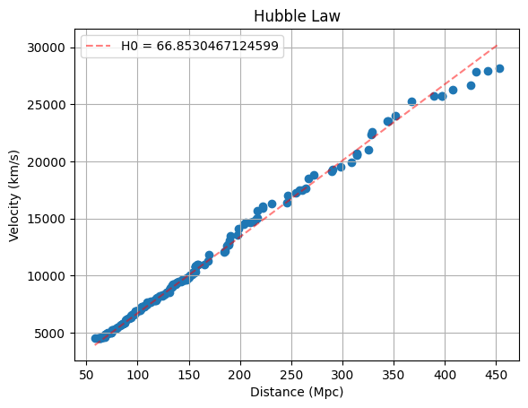

# Estimating the Hubble Constant (H0) from Type Ia Supernovae

## Overview
This project independently estimates the Hubble Constant (H0) by analyzing observational data from the Supernova Cosmology Project (SCP) Union2.1 Compilation. By extracting the redshift and distance modulus of Type Ia supernovae, this computational pipeline calculates the recessional velocity and physical distance of local galaxies, utilizing linear regression to measure the expansion rate of the universe.

## Data Pipeline & Methodology
1. **Data Ingestion:** Processed the raw, space-separated SCP Union2.1 text file using `pandas`, handling commented metadata and extracting the necessary columns (Redshift, Distance Modulus, and Error).
2. **Cosmological Filtering:** Applied a redshift cut (z < 0.1) to isolate the local universe, ensuring the linear Hubble's Law relationship holds true before dark energy significantly accelerates expansion.
3. **Mathematical Transformation:** Vectorized operations were used to translate observational measurements into physical units:
   * **Velocity:** Calculated using `v = c * z` (where c is the speed of light in km/s).
   * **Distance:** Derived from the distance modulus (mu) using `d = 10^((mu - 25) / 5)` to yield Megaparsecs (Mpc).
4. **Regression Analysis:** Utilized `scipy.optimize.curve_fit` to perform a least-squares linear regression. The model was strictly constrained to pass through the origin (0,0) to obey physical laws (a galaxy at 0 Mpc has 0 recessional velocity).

## Results
The computational pipeline successfully yielded a Hubble Constant of:
**H0 = 66.85 ± 1.42 km/s/Mpc**

This independent calculation closely aligns with modern accepted values derived from local universe observations and Cosmic Microwave Background (CMB) measurements.

## Visualizing the Expansion
Below is the generated scatter plot mapping the distance of Type Ia supernovae against their recessional velocity, overlaid with the line of best fit representing the calculated Hubble Constant.

 

## Technologies Used
* **Python:** Core programming language.
* **Pandas:** Data cleaning, filtering, and vectorized mathematical operations.
* **NumPy & SciPy:** Array extraction, covariance matrix generation, and linear curve fitting.
* **Matplotlib:** Data visualization and scientific plotting.
